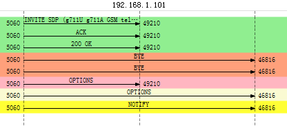

# sip client based on eXosip2
simple sip client that can make/recive calls. It's based on latest eXosip2 4.1.0. For more infomation about eXosip2 please visit http://www.antisip.com/doc/exosip2/modules.html.

samples that captured by Wireshark

